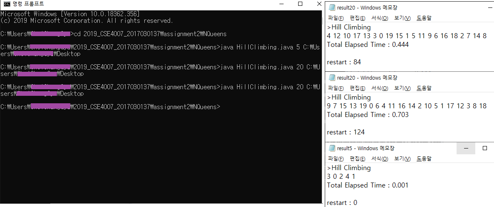
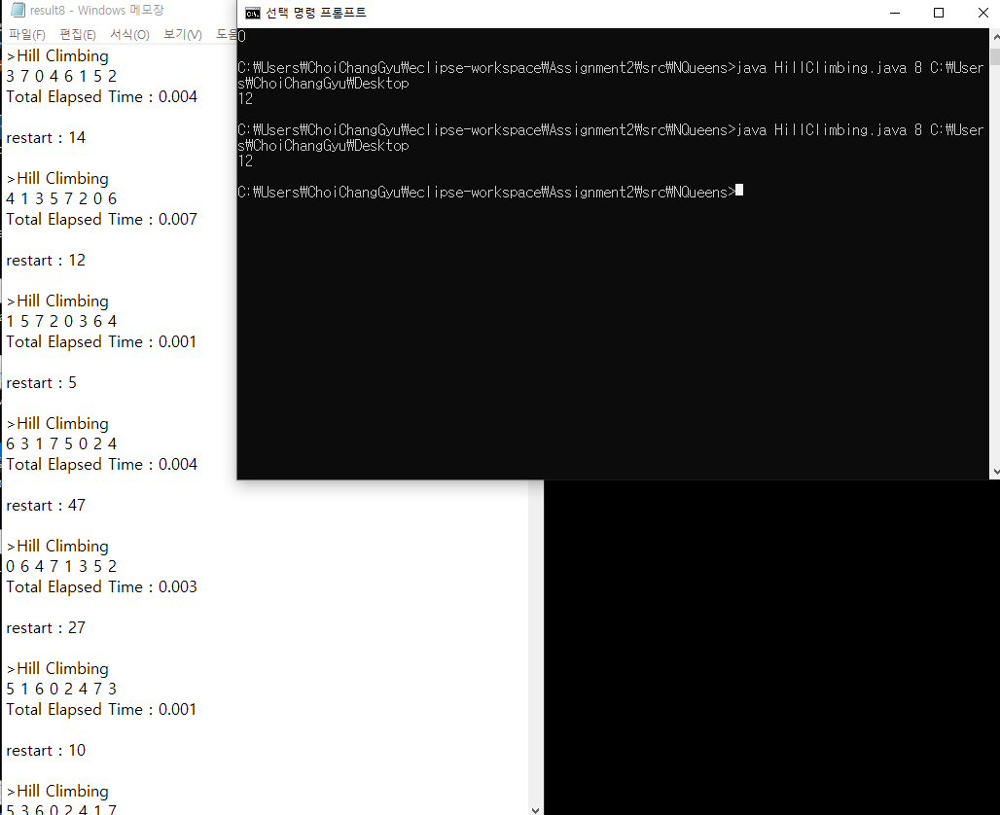

# Assignment2 : N-Queens problem<br>	Local Search - Hill Climbing

* N개의 Queen이 서로 공격할 수 없도록 배치하는 방법을 **Hill Climbing** 방법으로 탐색한다.
* 각 Column에 있는 Queen들의 초기 위치는 랜덤하게 지정한다.

------


###  1. 알고리즘 및 objective function에 대한 설명

#### **main**

* 출력해야하는 답은 *result*, 그 결과가 담인 파일의 저장 경로를 *path*라는 `String` 변수를 이용해 만든다.

* *HC* (hill climbing) 함수를 호출하기 전, *start*에 시간을 저장해둔다. 답을 찾았을 때의 시간에서 *start*만큼을 빼면 함수 실행 소요 시간을 구할 수 있다.

* `try-catch` 를 이용해 *result*를 파일에 적는다. *HC* 함수가 실행되면서 *result*에는 답이 저장된다.

  

#### **HC (Hill Climbing)**

1. 각 column에 퀸을 랜덤하게 배치한다.

```java
Random rand = new Random();
for(int i=0; i< N; i++) loc[i]=rand.nextInt(N);
```

2. 한 column씩 퀸을 옮겨보면서 탐색, 답을 찾는다.
   이때 objective function으로 현재 배치 상태 *loc* 에서 **서로 공격하지 못하는 queen의 개수**를 찾는 *get_state* 함수를 이용한다.

- 현재 배치상태에서 서로 공격하지 못하는 queen의 개수를 구한다.

  ```java
  int now = get_state(N, loc);
  ```

- 이 상태에서 각 column 마다 queen의 위치를 바꾼다. (loc[i]를 j로 수정, i=0~N-1, j=0~N-1 반복)

  ```java
  for(int i=0; i< N; i++) {
  　　// 원래 위치 : save, 바꿀 위치 : j
  　　int save = loc[i];
  　　for(int j=0; j< N; j++) {
  　　　　if(j==save) continue; // 같은 값이면 넘어가기
  　　　　loc[i]=j;
  ```

- 바뀐 배치상태에서 서로 공격하지 못하는 queen의 개수를 구한다.

  ```java
  　　　　　int nxt = get_state(N, loc);
  ```

- nxt가 now보다 크다면 답 (N개의 queen들이 모두 서로 공격하지 못 할 때)에 더 가까워진 것이므로 다음 node로 가능하다는 뜻이므로, 바뀐 부분을 저장해둔다. (i는 nxt_col 리스트에, j는 nxt_row 리스트에)

  ```java
  　　　　　 if(nxt>now) {
  　　　　　　cnt++;　　　　// 리스트에 저장된 값 개수
  　　　　　　nxt_col.add(i);
  　　　　　　nxt_row.add(j);
  　　　　}
  　　　　// 아니면 loc 원상복귀
  　　　　else loc[i]=saveb
  ```

- 리스트에 저장된 값들 중 랜덤한 한 쌍은 다음 node로 선택되어 탐색을 이어간다.

- 저장된 값이 없다면 탐색을 끝내고, 탐색이 끝났을 때의 배치상태는 local optimum이 된다.

  ```java
  // 다음 상태로 가능한 게 없으면 끝내기
  if(cnt==0) break;
  // 있으면 가능한 상태들 중 랜덤으로 하나가 다음 node
  else {
  　　rand = new Random();
  　　int n = rand.nextInt(cnt);
  　　loc[nxt_col.get(n)] = nxt_row.get(n);
  　}
  ```

3. 찾아낸 답은 아직 local optimum이므로, 조건을 만족한다면 final 답으로 간주하고 종료, 그렇지 않으면 다시 시작한다.

```java
if (get_state(N, loc) == N) break;
else restart++;
```


#### **get_state**

- 현재 배치된 N개의 Queen 중에 서로 공격하지 못하는 위치에 있는 queen의 개수를 return한다.

- 이 함수를 objective function으로 사용하여, 반환값이 N일 때가 final 답이다.

- assignment1에서 사용한 *isok()* 함수와 알고리즘은 같다.

- 각 column에 퀸이 몇 번 row에 위치하는지 나타내는 배열 chk[]을 인자로 받는다.

- 공격가능하면 stat을 true로 바꾼다.

- 배열에 같은 수가 들어있으면 가로로 공격이 가능하므로 만족하지 못하다고 판단한다.

  ```java
  if (chk[l] == chk[r]) stat = true;
  ```

- 배열의 두 인덱스 값의 차이와 그 인덱스에 해당하는 두 값의 차이가 같으면 대각선으로 공격이 가능하므로 만족하지 못하다고 판단한다.

  ```java
  int d = chk[l] - chk[r];
  if (d < 0) d *= -1;
  if (d == (r - l)) stat = true;
  ```

- stat이 false면 공격 불가능한 queen이므로 cnt를 늘린다. 0~N-1 column을 모두 확인한 후 cnt를 반환한다.


### 2. 실행 화면 출력

* result5, result20

  


### 3. 결과에 대한 분석

* N=8 인 경우를 1000번 실행, restart 횟수를 평균냈을 때의 결과가 12로 나왔다.

  

  * 8-Queens 문제의 답의 개수는 92개이다.