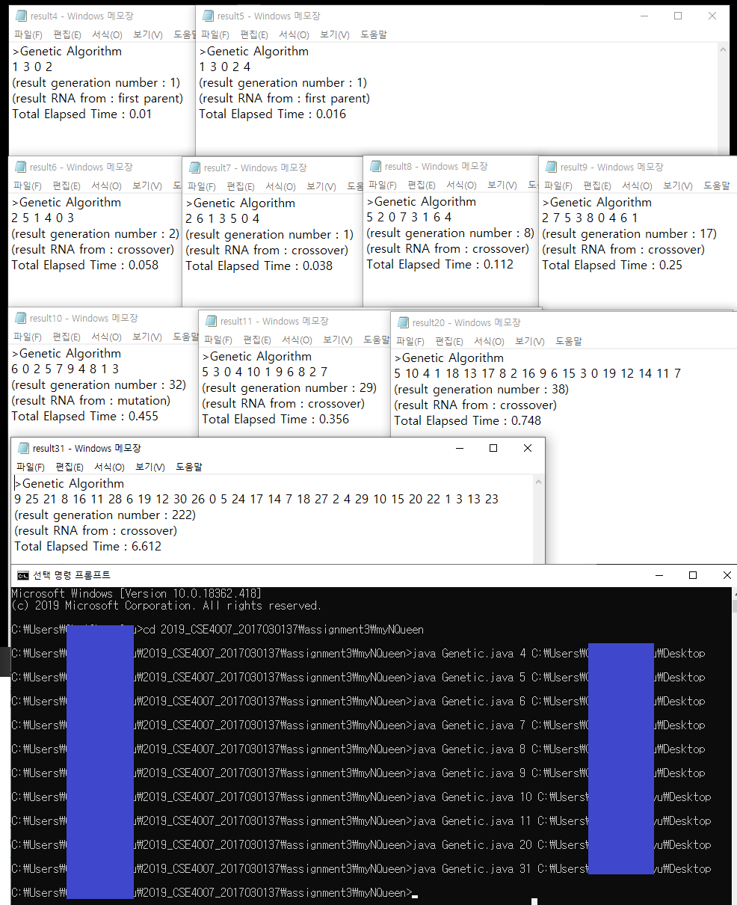
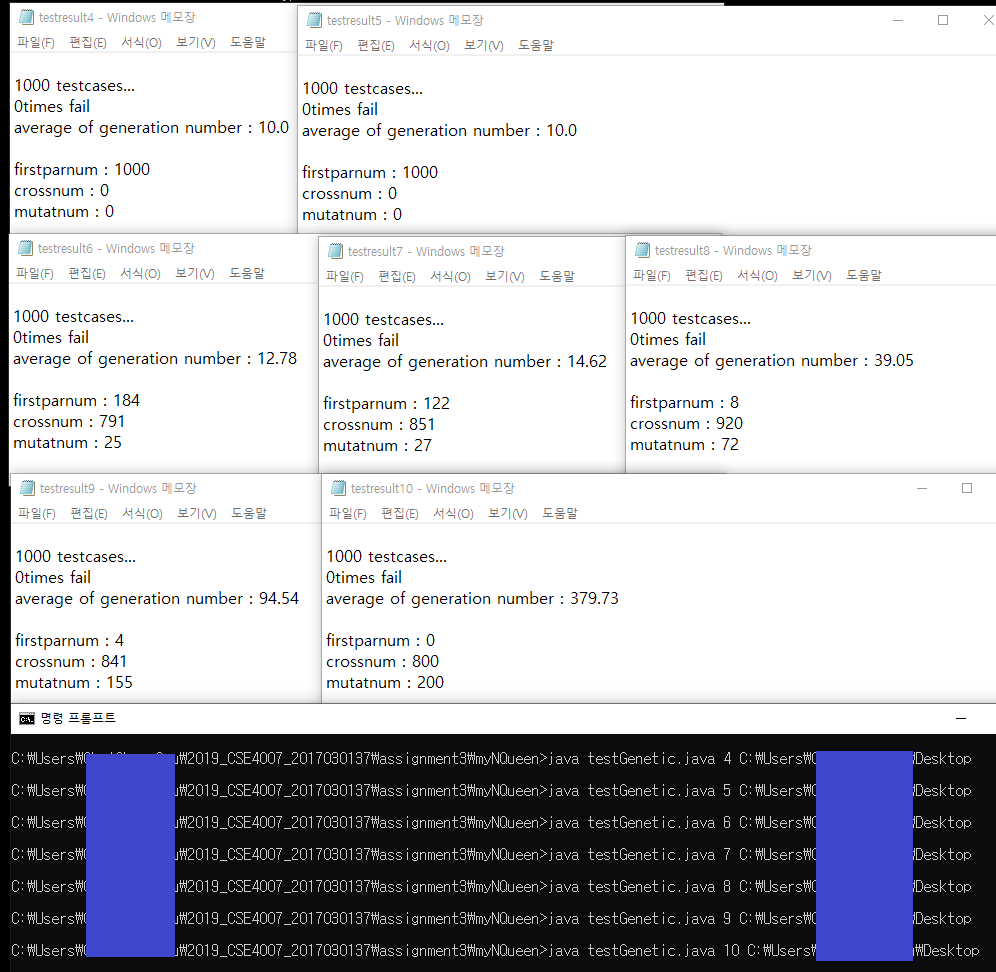
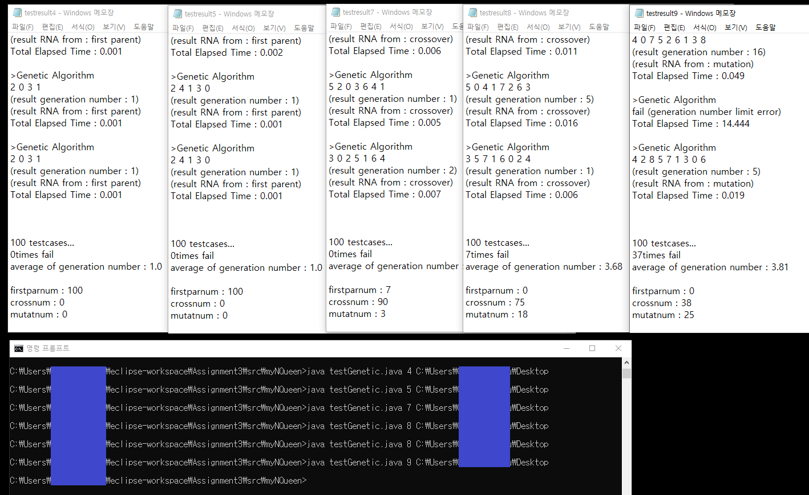

# Assignment3 : N-Queens problem<br>	Genetic Algorithm

* N개의 Queen이 서로 공격할 수 없도록 배치하는 방법을 **Genetic Algorithm**을 이용해 구한다.

------


###  1. 코드 설명

#### **main**

* assignment1,2에서 했던 방법과 마찬가지로 `String`변수에 답을 저장, `try-catch`로 파일에 이를 출력한다.

  


#### **class RNA**

```java
    static public class RNA implements Comparable<RNA>{
        int[] loc;
        int fit;
```

- RNA라는 클래스를 만들어 체스판 정보와 그에 대한 fitness 값을 갖게 한다.
- 체스판 정보는 배열을 이용해 `int[] loc`에 0~(N-1)의 Column에 있는 각 Queen의 row 위치를 나타낸다.

```java
        public RNA(int[] loc) {
            this.loc = loc;
            this.fit = get_fitness(this.loc);
        }
```

- fitness 값은 클래스의 생성자에서 `loc`배열을 인자로 받아 `get_fitness()`함수에서 반환된 값을 저장한다. (클래스가 생성될 때 fitness 값 계산이 이뤄지도록)

```java
        @Override
        public int compareTo(RNA input){
            return this.fit<=input.fit ? 1: -1; // fit이 클 수록 우선순위 높다
        }
```

- 클래스를 이용해 유전자에 대한 정보를 담은 이유는 부모 유전자로 선택할 때 가장 fit한 것을 고르려면 fitness 값이 N에 가장 가까운 (fitness 값이 가장 큰) 순서로 정렬해놓으면 편하고, 이 과정에서 priority queue를 사용하기 위해서이다. 따라서 클래서 내부에 비교함수도 override를 이용해 만들어주었다.

```java
        @Override
        public boolean equals(Object o) {
            return Arrays.equals(this.loc, ((RNA)o).loc);
        }
```

- 이 부분은 코드를 완성하고 몇 번의 실행을 거쳐본 후 추가한 부분이다.

- 중복된 부모 유전자를 선택하게 되면 (혹은 새로 만들어진 유전자여도 같은 정보(loc)를 갖고있으면) 답을 찾기 어려워지는 경우가 생긴다. 따라서 loc배열이 같은 유전자가 이미 존재한다면 이 유전자는 추가하지 않도록 알고리즘을 수정했고, 이를 위해 equals를 override 했다.

  

#### **parameter**들

```java
    static int pp_siz = 5000;       // population size
    static int pr_siz = 500;        // parent size (population size * 0.1)
    static int cross_siz = 4000;    // crossover로 만들어진 다음 세대 size
    static int mutat_siz = 500;     // mutation으로 만들어진 다음 세대 size
    // 다음세대(5000) = 부모(500)+부모crossover한거(4000)+mutation된거(500)

    static int k_siz = 7;       // 토너먼트 셀렉션에서 k번 선택
```

- GA 수업자료에 나온 wall following 예시의 experimental setup과 유사한 방식의 토너먼트 셀렉션으로 설정했다.

- population은 5000, crossover rate = 0.8, mutation rate = 0.1

- 한 generation에서 k(=7)개의 유전자를 선택, 그 중에 가장 fit한 것을 부모로 만들어준다. 이렇게 만들어진 부모 인구는 500이다.

- 이 부모를 crossover해 4000을 만들고, crossover된 것들을 랜덤으로 mutation해 500을 더 만든다.

  

#### **get_fitness()**

- 현재 배치된 N개의 Queen 중에 서로 공격하지 못하는 위치에 있는 queen의 개수를 리턴하고, 이를 fitness 값으로 사용한다.

- 각 column에 퀸이 몇 번 row에 위치하는지 나타내는 배열 `chk[]`을 인자로 받아 계산하고, 이 값이 N에 가까울 수록 fit한 유전자이다. (반환값이 N일 때는 답으로 채택한다)

- assignment1에서 사용한 isok 함수, assignment2에서 사용한 `get_state`함수와 같다. (코드 설명은 이전 위키 참고)

  

#### **Gene()**

- genetic algorithm을 쓰는 함수
- RNA가 pp_siz개 담겨있는 ArrayList `generation`은 한 세대를 의미하고, 이 중에 다음 세대로까지 넘어가는 부모 RNA는 ArrayList `par`에 pr_siz개 담겨있다.

```java
        ArrayList<RNA> generation = new ArrayList<>();

        for(int i=0; i<pp_siz; i++) {
            int loc[] = new int[N]; 
            Random rand = new Random();
            for(int j=0; j<N; j++) loc[j]=rand.nextInt(N);

            RNA r = new RNA(loc);
            generation.add(r);
        }
```

- 처음에 `generation`에 들어가는 RNA들은 각 column에 랜덤으로 퀸을 배치한 `loc`을 갖게한다.

#### (1) 부모(500)

```java
            ArrayList<RNA> par = new ArrayList<>();

            for(int i=0; i<pr_siz; i++){        
                PriorityQueue<RNA> pq = new PriorityQueue<>();

                for(int j=0; j<k_siz; j++) {
                    Random rand = new Random();
                    RNA r = generation.get(rand.nextInt(pp_siz));

                    if(par.contains(r)||pq.contains(r)) j--; // 중복이면 다시 선택
                    else pq.offer(r);
                }
                RNA frontRNA = pq.poll();

                if(frontRNA.fit == N) {
                    result_print(frontRNA.loc, num, "first parent", System.currentTimeMillis() - start);
                    return;
                }
                else par.add(frontRNA);
            }
```

- 한 세대에서 k개의 RNA를 랜덤으로 선택, 그 중 가장 fit한 한 개를 다음 세대의 부모유전자로 가져간다.
  이때 RNA를 priority queue로 fitness값에 따라 정렬시켜놓은 후 선택한다.
- fitness값이 N인 RNA는 답이므로 다음 세대로 넘어갈 필요도 없이 함수를 끝낸다.
- RNA를 랜덤으로 선택할 때 이미 부모리스트나 우선순위큐에 존재한다면 선택하지않는다. 존재여부는 `.contains()`로 파악한다. (이를 이용하기 위해 클래스에서 `equals`를 override했었다)

#### (2) crossover(4000)

- 부모로 선택된 RNA들 중 랜덤하게 2개를 뽑아 반반 섞어서 새 RNA를 만들어 다음 세대로 가져간다.

```java
                int[] nxtloc1 = new int[N];
                int[] nxtloc2 = new int[N];
                for(int j=0; j<N; j++) {
                    if(j<(int)N/2) {
                        nxtloc1[j] = par1.loc[j];
                        nxtloc2[j] = par2.loc[j];
                    }
                    else {
                        nxtloc1[j] = par2.loc[j];
                        nxtloc2[j] = par1.loc[j];
                    }
                }
                RNA nxt1 = new RNA(nxtloc1);
                RNA nxt2 = new RNA(nxtloc2);
```

- 부모 RNA `par1`, `par2`의 앞 뒤 절반씩 섞어서 새 RNA `nxt1`, `nxt2`를 만든다.
- 새 RNA들의 fitness값이 N이 된다면 답이므로 (1)에서와 마찬가지로 함수를 끝내고, 그렇지 않으면 `generation.add(nxt)`한다.

#### (3) mutation(500)

- 돌연변이는 새로 생기는 과정에서 이상해지는 것이므로 (2)에서 crossover로 만들어진 RNA 중 랜덤하게 선택, 랜덤한 위치를 랜덤한 수로 바꾼다.

```
                rand = new Random();
                int r_idx = rand.nextInt(N);
                rand = new Random();
                int r_num = rand.nextInt(N);

                nxtloc[r_idx] = r_num;

                RNA nxt = new RNA(nxtloc);
```

- `nxtloc`에 crossover로 만들어진 RNA 중 랜덤한 것의 `loc`을 그대로 복사한 후, 그 중 랜덤한 idx를 랜덤한 num으로 바꾼다. 이렇게 만들어진 배열로 새 RNA `nxt`를 만들어 `generation.add()`한다.


이 과정을 답이 나올 때 까지 반복한다. 답이 쉽게 나오지 않는 경우도 생길 수 있기 때문에 무한반복이 아닌 `max_num` 회 시도 후 답이 나오지 않으면 fail을 출력하도록 했다.


### 2. 실행 결과



- 보통 N이 4, 5일 때는 1세대에서 답을 찾는 결과가 나왔다. 인구 수를 5000으로 잡았기 때문에 랜덤하게 1세대를 채우는 과정에서 답이 나오는 것으로 보인다.
- 결과들을 분석해보기 위해 testGenetic.java에서는 1000번 돌렸을 때 답이 찾아지는 generation 번호의 평균, 각 방법 (1세대, crossover, mutation)에서 답이 찾아진 횟수를 계산했다.



- N이 4,5일 때에는 전부 1세대에서 답을 찾았다.

- N의 값이 커질수록 돌연변이로 답을 찾는 비율이 커졌다.

  

- 앞서 언급했듯 중복된 부모를 처리하는 과정에서 코드를 수정했고, 이로인해 실행결과나 답을 찾는 속도가 많이 달라졌다.



- 이 결과를 보면 fail횟수 (10만번 반복해도 답이 나오지 않을 때) 가 꽤 많이 나왔다.
- 이를 통해 중복된 부모 (다양하지 않은 유전자) 가 유전알고리즘에서 큰 영향을 미친다는 것을 알 수 있었다.