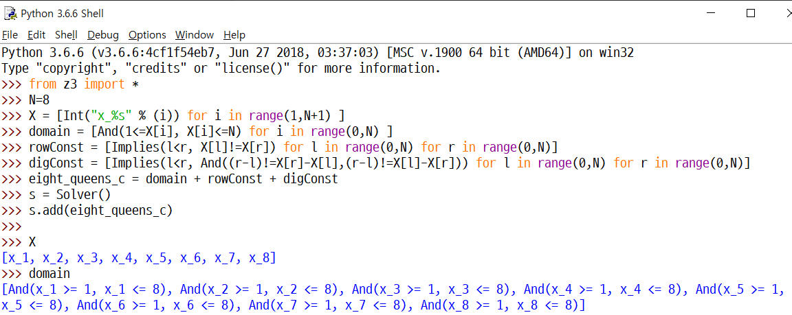
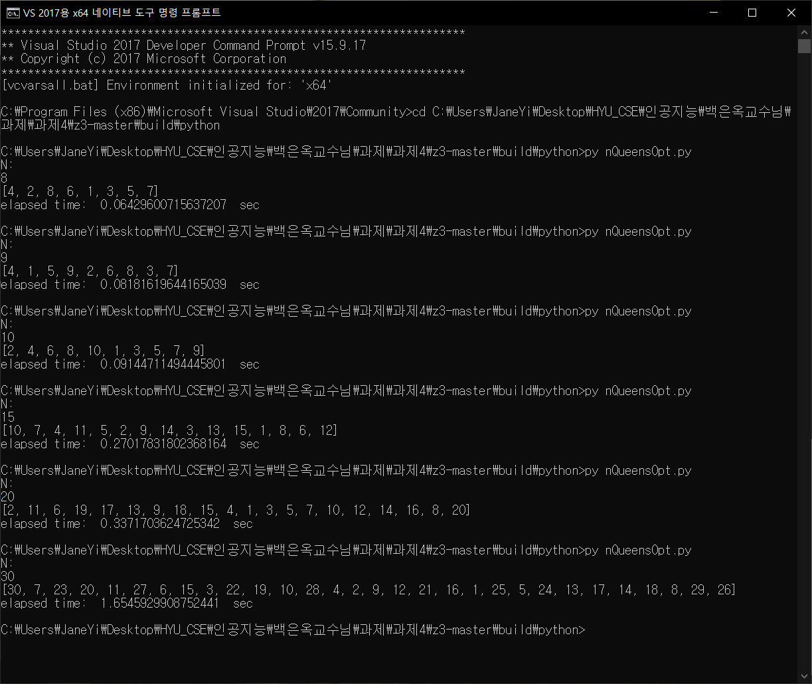
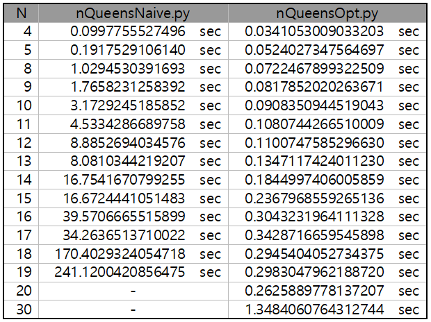

# Assignment4 : N-Queens problem<br>	Propositional Logic - SAT Solver

* N개의 Queen이 서로 공격할 수 없도록 배치하는 방법을 **SAT Solver z3** 을 이용해 propositional logic 방법으로 구한다.

------


### **variables (symbols)**

```python
X = [Int("x_%s" % (i)) for i in range(1,N+1) ]
```

- 1~N의 Column에 있는 각 Queen의 row 위치를 저장하는 배열

- N=8일 때 X는 `[x_1, x_2, x_3, x_4, x_5, x_6, x_7, x_8]`가 된다.

  

### **constraints (formulas)**

```python
domain = [And(1<=X[i], X[i]<=N) for i in range(0,N) ]
rowConst = [Implies(l<r, X[l]!=X[r]) for l in range(0,N) for r in range(0,N)]
digConst = [Implies(l<r, And((r-l)!=X[r]-X[l],(r-l)!=X[l]-X[r])) for l in range(0,N) for r in range(0,N)]
```

- *x_i*에 들어갈 수 있는 값은 1~N이므로 domain을 `1<=X[i]<=N`으로 설정한다.

- *X[0~N-1]*은 1보다 크거나 같고 N보다 작거나 같은 두 조건을 동시에 만족해야하므로 `And`로 묶어준다.

- 퀸 배치 상태에서 left column의 row번호와 right column의 row번호가 같으면 가로로 공격 가능하므로 `left<right, X[left]!=X[right]` 라는 constraint를 추가한다.

- 퀸 배치 상태에서 left column의 row번호와 right column의 row번호의 차이가 left~right 차이와 같으면 대각선으로 공격 가능하므로 `left<right, (right-left)!=abs(X[left]-X[right])` 라는 constraint를 추가한다.

- `abs()`는 양수, 음수 두 경우를 `And`로 묶어 구한다.

  

### **assignments (models)**

```python
eight_queens_c = domain + rowConst + digConst

s = Solver()
s.add(eight_queens_c)

if s.check() == sat:
    m = s.model()
    r = [m.evaluate(X[i]) for i in range(0,N)]
    print(r)
```

- constraints를 모두 만족시키는 상태


##### * 예 : N=8일 때




#### 실행화면



* ##### 실행시간 비교

  

  * naive는 N이 2개씩 쌍으로 비슷한 시간이 소요되고, 그 다음 쌍으로 넘어갈 때 약 2배 걸린다. optimized는 증가폭이 naive에서 쌍으로 비슷한 시간의 증가폭보다도 작다.
  * N이 커질수록 증가폭도 커진다.
  * N이 커진다고 시간이 항상 커지는 것은 아니다.
