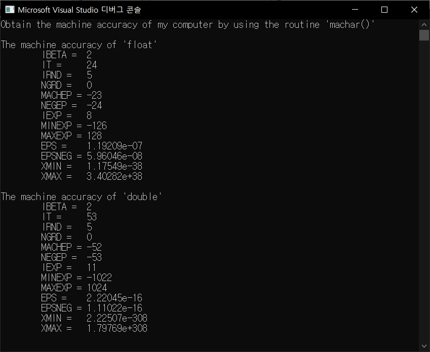
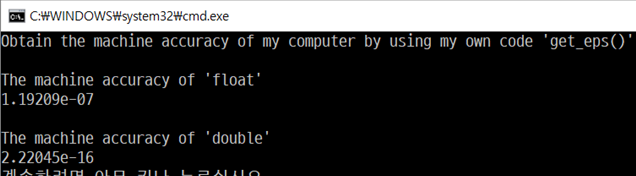

## Assignment1

## Programming: Obtain the machine accuracy of “float” and “double” of your computer in two ways.

### 1. Use the routine *machar()* in *NR in C*

> machar.cpp

책에서 주어진 routine으로 machar_float()를 만들고, float을 double로 바꿔 machar_double()도 만든다.

여기서 리턴하는 eps값이 machine accuracy이다. 

실행 결과는 다음과 같다.

### 2. Use your own code, *get_eps()*, which is based on finding minimum *n* that satisfies 1+2^(-*n*)=1

> my_geteps.cpp

machine accuracy의 정의는 floating-point 수 1.0에 더했을 때 1.0과 다른 floating-point 결과를 만들어내는 가장 작은 floating-point 수이다. 즉, ‘1보다 크면서 1과 가장 가까운 수’를 구하여 그 수와 1의 차이를 구하면 된다.

이때 ‘1+2-*n*=1’을 만족하는 최소 n을 구하는 것이므로 2로 나눠가며 수를 구하면 된다.

따라서 다음과 같은 알고리즘을 생각할 수 있다.

[0] add는 더하려는 수 (1.0으로 초기화), tmp는 더해지는 수, eps는 리턴해야하는 입실론 값

[1] add를 2로 나누고, tmp = add+1.0에서 1.0을 뺀다.

[2] tmp가 0보다 작거나 같아지기 전까지 반복. 반복 끝나기 직전 tmp값이 eps가 된다.

이 알고리즘으로 get_eps_float()를 다음과 같이 만들 수 있고, machar()와 마찬가지로 float를 double로 바꾸면 get_eps_double()도 만들 수 있다.

실행 결과는 다음과 같다.

