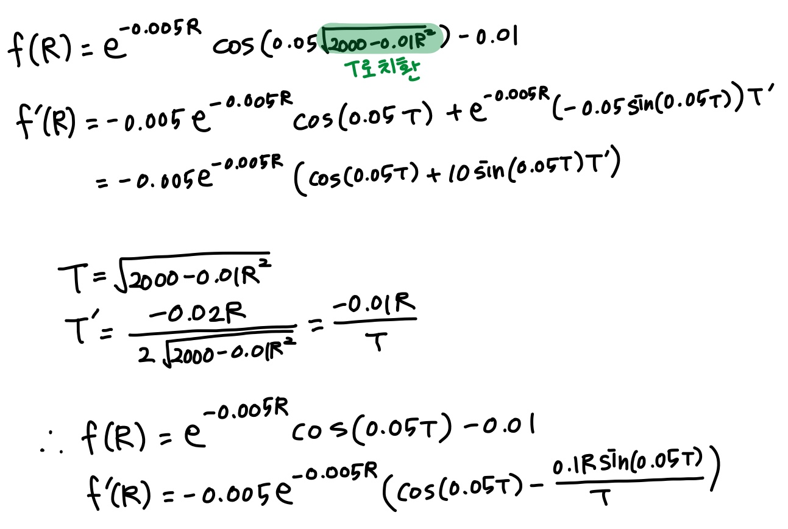
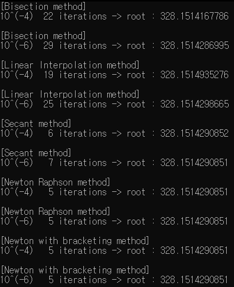
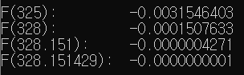

## Assignment4

## Application of Root Finding: Electric circuit design

 

특정한 t, L, C 값을 갖는 전자 회로에서 에너지를 절감하기 위한 적절한 R값을 root
finding 알고리즘을 이용해 찾아낸다.

따라서 초기 예상 범위를 0부터 400까지로 설정하고, 오차범위가 10^−4일 때, 10^−6일
때 각각 찾는다.

주어진 식을 코드로 바꾸기 위해 다음과 같은 계산 과정을 거친다.

 

```C
// 치환
#define T (double)sqrt(2000 - 0.01*R*R)

// 주어진 함수
double F(double R) {
	return pow(exp(1.0), -0.005*R)*cos(0.05*T) - 0.01;
}
// 주어진 함수의 미분
double F_(double R) {
	return -0.005*pow(exp(1.0),-0.005*R)*(cos(0.05*T)-0.1*R*sin(0.05*T)/T);
}
```

초기범위 x1=0, x2=400, 오차범위 xacc=1e-4 or 1e-6로 각 방법을 수행한다. 코드는 NR in C 의 rtbis, rtflsp, rtsec, rtnewt, rtsafe 함수들을 사용했다.

이때 newton raphson 방법을 이용하는 rtnewt, rtsafe 함수의 인자에서 사용되는 포인터 함수를 추가로 만들어준다.

```C
// newton raphson 방법 사용 시 필요한 포인터 함수
void Fd(double R, double* fn, double* df) {
	*fn = F(R);
	*df = F_(R);
}
```

각 함수는 적절한 root값을 찾아 return할 때 print함수로 넘어가 방법 이름, 오차범위, 반복 횟수 (j 값), root를 출력한다.

실행 결과는 다음과 같다.

 

문제에서 주어진 그래프에는 root가 325에 가깝다고 했지만, 실행 결과 328에 가까운 값이 나왔다. 그래서 F 함수의 리턴 값을 그대로 출력해보았다.

 

328.151429가 root로 계산된 이유는 F 함수에서 math.h의 pow, sqrt를 사용해 생기는 오차로 인한 것이라고 생각된다.

