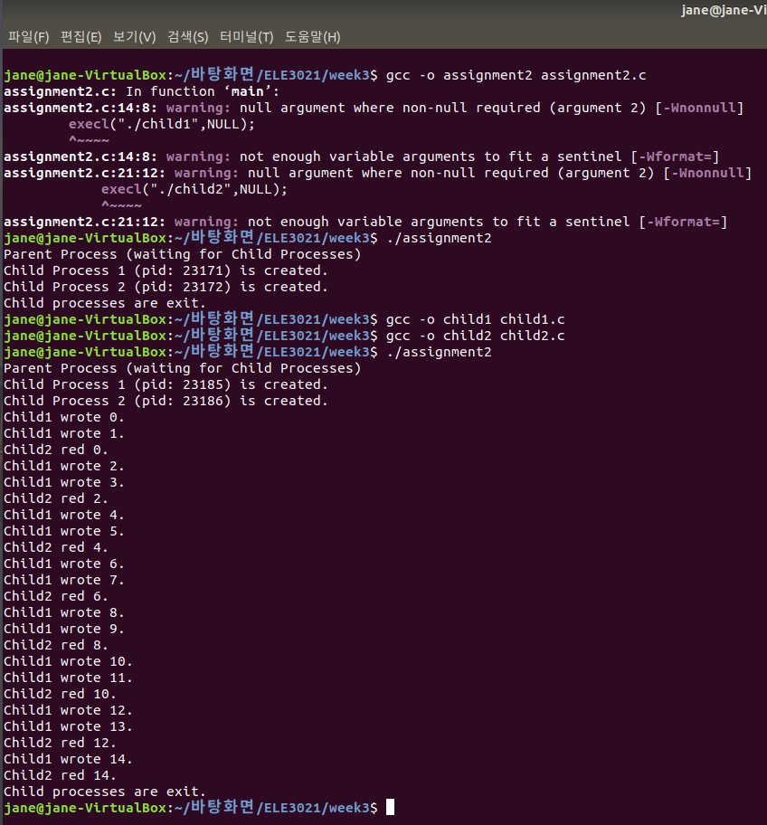

## 운영체제 Assignment2

## Process Control: fork-exec

Fork() 와 exec 함수를 활용하여 fork-exec 구조 구현

* 부모 프로세스
  * 두 개의 자식 프로세스를 생성한 후 자식이 모두 종료될 때까지 기다린 후 종료 (waitpid 사용)
  * 각각의 자식 프로세스는 exec 함수를 사용하여 새로운 프로그램 실행
* 자식 프로세스 1
  * test.txt 파일을 w 모드로 열어 1 초 간격으로 숫자와 개행문자를 쓰며 숫자는 1 씩 증가
* 자식 프로세스 2
  *  test.txt 파일을 r 모드로 열어 2 초 간격으로 첫번째 줄을 읽고 이를 화면에 출력
* 조건
  * 자식 프로그램을 구현할 때 fopen , fprintf , fseek , fgets , fclose 을 활용하여 구현

---

#### 부모 프로세스 (`parent.c`)

```c
// 자식 프로세스 1 생성
pid_t pid = fork();
if(pid==0){
    printf("Child Process 1 (pid: %d) is created.\n",getpid());
    execl("./child1",NULL);
}
```

fork를 통해 자식 프로세스 하나를 만들고 execl을 통해 child1를 실행한다. 

```c
else{
    // 자식 프로세스 2 생성
    pid = fork();
    if(pid==0){
        printf("Child Process 2 (pid: %d) is created.\n",getpid());
        execl("./child2",NULL);
    }
```

그 후 한 번 더 fork를 통해 자식 프로세스를 만들고 execl을 통해 child2를 실행한다. 

```c
	else{
		printf("Parent Process (waiting for Child Processes)\n");
        waitpid(pid, &status, 0);
        printf("Child processes are exit.\n");
	}
}
```

실행하는 동안 부모 프로세스는 waitpid를 통해 자식 프로세스가 끝날 때까지 기다린다.

#### 자식 프로세스 (`child1.c`, `child2.c`)

```c
// 자식 프로세스 1
FILE* fp = fopen("./test.txt", "w");
for(int i=0; i<limit; i++){
    fseek(fp,0,SEEK_SET);
    fprintf(fp,"%d\n",i);
    printf("Child1 wrote %d.\n",i);
    sleep(1);
}
```

```c
// 자식 프로세스 2
FILE* fp;
whild(1){
    sleep(2);
    fp = fopen("./text.txt", "r");
    fseek(fp,0,SEEK_SET);
    char buf[10];
    fgets(buf,sizeof(buf),fp);
    buf[strlen(buf)-1]='\0'; // \n없애기
    printf("Child2 red %s.\n",buf);
    
    if(atoi(buf)==limit-1) break;
}
```

fopen으로 텍스트 파일을 연다.

반복문을 실행할 때마다 fseek를 통해 파일의 맨 앞(SEEK_SET)으로 포인터를 이동한다.

그 위치에 child1은 fprintf를 통해 숫자를 쓰고, child2은 fgets를 통해 숫자를 읽는다.

반복문을 한 번 실행할 때마다 각각 1초, 2초 간 sleep하고, 미리 지정한 limit까지만 반복한다.

```c
fclose(fp);
exit(0);
```

모든 실행이 끝난 후 fclose로 파일을 닫고 exit한다.


#### 컴파일 및 실행결과



부모 프로세스만 실행했을 때는 자식 프로세스들이 아무 것도 수행하지 않고 끝나지만, child1과 child2를 컴파일한 후 재실행하면 child1이 1초마다 숫자를 쓰고 child2가 2초마다 쓰여진 숫자를 올바르게 읽는다.

---

#### fork-exec 구조 설명

fork를 통해 만들어진 자식 프로세스는 현재 프로세스의 복사본이다. 따라서 부모 프로세스와 똑같은 코드를 진행하기 때문에, exec를 통해 사용자가 원하는 코드의 프로그램을 실행하도록 바꿔준다.