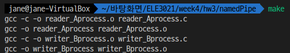

## 운영체제 Assignment3

## IPC: reader, writer process

IPC 메커니즘을 사용하여 프로세스간 통신하는 프로그램 작성

* Writer 인 A 프로세스, Reader 인 B 프로세스로 구성
* A 프로세스로 사용자 입력 쉘 입력 이 들어올 때마다 A 프로세스는 B 프로세스에게 들어온 데이터를 제공
  * 사용자 입력의 구분자는 엔터로 사용
* B 프로세스에게 데이터를 제공하는 방식은 IPC (Named Pipe, Message Queue, Shared Memory) 사용
  * B 프로세스는 데이터를 제공받을 때마다 제공받은 데이터를 화면에 출력
* While 문을 사용하여 프로그램을 구성하며 종료 방식은 개인이 원하는 대로 종료 방식을 정함

---

### Named Pipe

#### 1. 프로그램 설명

B 프로세스가 write한 데이터를 named pipe로 A 프로세스가 read한다.

reader 프로세스를 먼저 실행하여 named pipe 파일을 생성한 후 writer 프로세스를 실행하여 메시지를 입력한다.

입력할 때마다 reader 프로세스가 데이터를 받아와 출력하고, 10회의 입출력이 끝나면 두 프로세스가 종료된다.

#### 2. IPC 메커니즘 설명

* Reader
  * named pipe가 될 파일(파이프) 이름을 지정한다. 이미 파이프가 존재하는지 access로 확인한 후, 있으면 unlink로 파이프를 지운다.
  * mkfifo로 파이프를 생성한다.
  * open으로 파이프를 연다. 이때 읽기쓰기 모두 가능하도록 권한을 RDWR로 설정한다.
  * read로 파이프 내부의 문자열을 읽어 출력한다.
* Writer
  * open으로 미리 지정된 이름의 파이프를 연다. 이때 쓰기만 가능하도록 권한을 WRONLY로 설정한다.
  * 사용자가 문자열을 입력하고, 이를 write로 파이프에 쓴다.

#### 3. 컴파일 및 실행 결과

다음과 같이 make로 컴파일한다.

실행결과는 다음과 같다.

* 입력 전

  

* 입력 후

  

---

### Message Queue

#### 1. 프로그램 설명

B 프로세스가 write한 데이터를 message queue로 A 프로세스가 read한다.

먼저 실행된 프로세스가 message queue을 생성하면, 다른 프로세스가 이를 참조하여 사용한다.

writer 프로세스가 메시지를 입력하여 전송한다.

입력할 때마다 reader 프로세스가 데이터를 받아와 출력하고, 10회의 입출력이 끝나면 두 프로세스가 종료된다.

#### 2. IPC 메커니즘 설명

(writer 프로세스를 먼저 실행했을 때 기준)

* Reader (Consumer)
  * 생성된 message queue의 고유번호를 인자로 사용하여 msgget으로 message queue의 id를 받아온다.
  * msgrcv로 그 id의 message queue에 담겨 있는 msgbuf 구조체를 꺼내 문자열을 출력한다.

* Writer (Producer)
  * msgget으로 message queue를 생성한다.
  * 사용자가 입력한 문자열을 msgbuf 구조체에 담는다.
  * msgsnd로 전송할 구조체를 message queue에 넣는다.

#### 3. 컴파일 및 실행 결과

다음과 같이 make로 컴파일한다.

실행결과는 다음과 같다.

* 입력 전

  

* 입력 후

  

---

### Shared Memory

#### 1. 프로그램 설명

B 프로세스가 write한 데이터를 shared memory로 A 프로세스가 read한다.

writer 프로세스를 먼저 실행하여 shared memory를 생성, 이를 프로세스 메모리 공간에 붙인다.
사용자가 입력한 문자열을 메모리에 넣고, 지정된 사이즈(MSGSIZE)만큼 포인터를 이동하여 다시 입력한다. 10회의 입력이 끝나면 shared memory를 프로세스 메모리 공간에서 떼어낸 후 프로세스가 종료된다.

그 후 reader 프로세스를 실행하여 정해진 key값을 통해 그 shared memory를 가져오고 프로세스 메모리 공간에 붙인다.
메모리에 담긴 문자열을 읽어 화면에 출력한 후 지정된 사이즈(MSGSIZE)만큼 포인터를 이동하여 다시 읽는다. 10회의 출력이 끝나면 shared memory를 프로세스 메모리 공간에서 떼어내고 삭제한 후 프로세스가 종료된다.

#### 2. IPC 메커니즘 설명

* Writer
  * shmget으로 지정된 key 값의 shared memory를 생성하고, 아이디 값인 shmid를 얻는다.
  * shmat으로 shmid를 갖는 shared memory를 프로세스 메모리 공간에 attach하여 주소 값인 shmaddr를 얻는다.
  * 사용자가 입력한 문자열을 shmaddr에 저장한다.
  * shmdt으로 attach된 위치(원래의 shmaddr값)에서 shared memory를 detach 한다. 

* Reader
  * shmget으로 지정된 key 값의 shared memory를 가져오고, 아이디 값인 shmid를 얻는다.
  * shmat으로 shmid를 갖는 shared memory를 프로세스 메모리 공간에 attach하여 주소 값인 shmaddr를 얻는다.
  * shmaddr에 저장된 문자열을 출력한다.
  * shmdt으로 attach된 위치(shmaddr)에서 shared memory를 detach한다.
  * shmctl로 shmid의 shared memory를 삭제한다.

#### 3. 컴파일 및 실행 결과

다음과 같이 make로 컴파일한다.

실행결과는 다음과 같다.

* 입력 전

  

* 입력 후

  