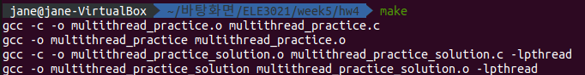

## 운영체제 Assignment4

## Multithread

주어진 코드 `multithread_practice.c`의 실행시간이 감소하도록 수정

* 스레드 측면 요구사항
  * pthread 라이브러리를 사용하여 멀티스레드 적용
  * 스레드의 개수는 ARGUMENT_NUMBER 에 선언된 만큼 생성하며 각 스레드는 ThreadFunc() 실행
  * 스레드가 모두 생성되면 “Main Thread is waiting for Child Thread!” 출력
  * 모든 스레드가 종료되기까지 기다린 후 result 변수 값 출력
* 프로그램 측면 요구사항
  * 'lock'을 사용하지 않는 조건에서 result 변수의 값이 언제나 같은 값을 갖도록 구성
  * 프로그램 실행 시간을 리눅스의 time 명령어를 사용해 출력
  * Hint: 각 스레드 별 연산 결과를 담을 변수 추가 선언

---

#### `multithread_practice_solution.c`

0부터 19까지의 숫자를 25000000번씩 더한 결과값을 출력하는 프로그램이다.

각 숫자들마다 ThreadFunc 함수를 호출하여 result 변수에 누적하여 더한다. 더하는 횟수가 많기 때문에 그냥 실행할 경우 시간이 오래 걸려, 함수를 더하는 숫자마다 여러 개의 스레드로 나누어 실행한다.

```c
// 스레드 생성
for(ll i=0; i<ARGUMENT_NUMBER; i++){
    pthread_create(&(threadID[i]), NULL, ThreadFunc, (void*)&argument[i]);
}
```

pthread_create로 함수마다 스레드를 생성해서 실행한다. 

```c
ll ret=0;
for(ll i=0; i<25000000; i++){
    ret += number;
}
// 현재 스레드 결과 값 저장
results[number]=ret;
```

각 함수는 숫자를 더한 후 results 배열에 값을 저장한다.

```c
// 스레드 종료되면 각 스레드 결과 값 합치기
for(ll i=0; i<ARGUMENT_NUMBER; i++){
    pthread_join(threadID[i], NULL);
    result+=results[i];
}
```

pthread_join로 스레드들의 종료를 기다리고, 종료가 될 때마다 results 배열에 저장된 값을 result 변수에 누적하여 합한다.

#### 컴파일 및 실행결과




#### Time 결과값

user는 유저모드에서의 소요시간, sys는 커널모드에서의 소요시간, real은 이 둘과다른 작업까지 포함하는 실제 소요시간이다.

멀티스레드에서는 user와 sys 시간을 스레드 개수만큼 곱해서 보여주기 때문에 두 번째 프로그램의 실행에서 user가 real보다 더 큰 값으로 출력되었다.

두 프로그램의 시간은 real로 비교한다. 싱글스레드를 사용한 첫 번째 프로그램의 소요시간은 1.27초, 멀티스레드를 사용한 두 번째 프로그램의 소요시간은 0.39초로 멀티스레드가 훨씬 빠르다.

* 시간 차이가 나는 이유

  멀티스레딩으로 프로그램을 실행하면 동시에 여러 개의 일을 수행할 수 있기 때문에 시간이 적게 걸린다.