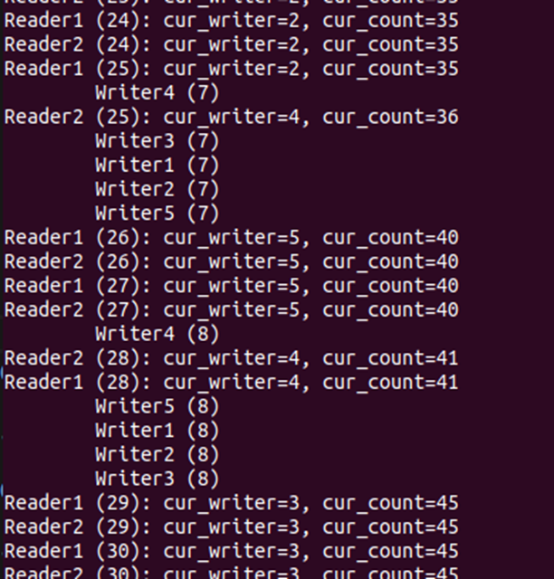
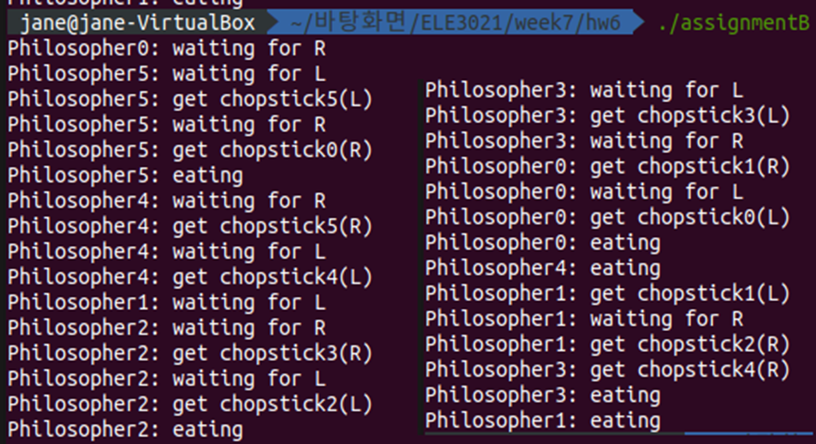

## 운영체제 Assignment6

## Semaphore: Producer-Consumer problem

### 과제 A: First Readers-Writers problem

주어진 First Readers-Writers problem 을 semaphore 를 사용하여 구현

* First Readers-Writers problem 명세

  * 2 명의 reader 와 5 명의 writer 가 존재
  * Writer 가 접근하고 있을 동안 어떠한 reader/writer 도 critical section 에 접근할 수 없음
  * Reader 가 접근하고 있을 동안 어떠한 writer 도 접근할 수 없지만 다른 reader 는 critical section 에 접근 가능

* Critical Section 명세

  * Critical section 에서 접근될 변수는 cur_writer , cur_count 두 가지가 있음

  * Critical section 에 접근한 writer 는 writer 를 식별할 수 있는 writer id 를 cur_writer 에 쓰며 해당 writer 가 critical section 에 접근한 총 횟수를 cur_count 에 씀

  * Reader 는 cur_writer 와 cur_count 를 읽어서 이를 화면에 출력

  * 단순하게 최근에 cur_count 에 접근한 writer ID( cur_writer 값) 을 읽어서 출력

    

#### 1. 자료구조 설명

```c
pthread_t threadReader[2];
pthread_t threadWriter[5];

int readerID[2]={1,2};
int writerID[5]={1,2,3,4,5};
```

2개의 reader 스레드, 5개의 writer 스레드를 담을 배열과 각 스레드의 id 번호를 저장해둔 배열을 선언한다.

```c
int cur_writer=0; // CS에 접근한 writer id
int cur_count=0; // writer가 CS에 접근한 총 횟수

int readcnt=0; // 현재 CS에 접근 중인 reader 수
sem_t S, wrt;
```

critical section에서 접근될 변수 cur_writer와 cur_count는 int로 선언한다.

동기화 문제를 해결하기 위해 변수 readcnt와 semaphore S, wrt를 사용한다. S는 readcnt에 값을 쓸 때 겹치지 않게 하는 역할이고, wrt는 reader, writer의 mutual exclusion을 위한 역할이다.

#### 2. 함수 설명

1. writer

   ```c
   void writer(void* arg){
       int id = *(int*)arg;
       for(int i=0; i<COUNTING_NUMBER; i++){
   ```

   스레드를 만들 때 인자로 넘겨준 값이 writer의 id이다.

   COUNTING_NUMBER번 CS에 반복 접근한다. 

   ```c
   // Lock
   sem_wait(&wrt);
   
   // Critical Section
   printf("\tWriter%d (%d)\n",id,i);
   cur_writer=id;
   cur_count++;
   
   // Unlock
   sem_post(&wrt);
   ```

   critical section의 동기화 문제를 semaphore를 이용해 해결한다.

   sem_wait로 wrt값이 0이면 대기하고, 1이면 0으로 바꿔 다른 reader나 writer의 접근을 막고 해당 writer는 CS에 접근한다.

   CS에선 cur_writer에 해당 writer id 값을 쓰고 cur_count 값을 1 증가시킨다.

   공유 변수 사용이 끝나면 sem_post로 wrt 값을 1 증가시킨다.

2. reader

   ```c
   void reader(void* arg){
       int id = *(int*)arg;
       for(int i=0; i<COUNTING_NUMBER; i++){
   ```

   스레드를 만들 때 인자로 넘겨준 값이 reader의 id이다.

   COUNTING_NUMBER번 CS에 반복 접근한다. 

   ```c
    // Lock
   sem_wait(&S);
   readcnt++;
   if(readcnt==1) sem_wait(&wrt);
   sem_post(&S);
   
   // Critical Section
   printf("Reader%d (%d): cur_writer=%d, cur_count=%d\n",id,i,cur_writer,cur_count);
   
   // Unlock
   sem_wait(&S);
   readcnt--;
   if(readcnt==0) sem_post(&wrt);
   sem_post(&S);
   ```

   현재 CS에 접근 중인 reader 수를 저장하는 readcnt에 접근할 때의 동기화 문제에서도 semaphore를 이용한다. sem_wait로 S가 0이 아닐 때만 readcnt 값을 1 증가시키고, 그 후 sem_post로 S를 다시 1 증가시킨다. readcnt가 1일 때는 sem_wait로 wrt값이 0이면 대기하고, 1이면 0으로 바꿔 writer의 접근을 막고 해당 reader는 CS에 접근한다.

   CS에서 cur_writer와 cur_count 값을 읽어 출력한다.

   공유 변수 사용이 끝나면 readcnt에 접근하기 전/후에 S로 동기화하고 readcnt를 1 감소시킨다. readcnt가 0이면 sem_post로 wrt값을 1 증가시켜 writer의 접근을 허용한다.

#### 3. 프로그램 구조 설명

```c
int main(){
    sem_init(&S,0,1);
    sem_init(&wrt,0,1);
```

sem_init으로 두 semaphore 값을 1로 초기화한다.

```c
for(int i=0; i<2; i++){
        pthread_create(&threadReader[i],NULL,(void*)&reader,(void*)&readerID[i]);
    }
    for(int i=0; i<5; i++){
        pthread_create(&threadWriter[i],NULL,(void*)&writer,(void*)&writerID[i]);
    }
    
    for(int i=0; i<2; i++){
        pthread_join(threadReader[i],NULL);
    }
    for(int i=0; i<5; i++){
        pthread_join(threadWriter[i],NULL);
    }
```

pthread_create로 2개의 reader, 5개의 writer 스레드를 만들어 각각 reader/writer 함수를 실행한다. 이때 인자로 각 스레드 id를 넘겨준다.

pthread_join으로 모든 스레드가 종료될 때까지 기다린다.

```c
sem_destroy(&S);
sem_destroy(&wrt);
```

 sem_destroy로 semaphore를 파괴하고 끝낸다.

#### 4. 실행 결과 (예시 일부)



#### 5. 프로그램이 어떻게 First Reader-Writers Problem을 해결하는지 설명

critical section에 접근하기 전/후에 semaphore를 이용해 lock/unlock 한다.

1. writer

   * Lock

     wrt 값이 0일 경우 현재 다른 writer나 reader가 CS에 접근 중인 것이므로 sem_wait에 머무르고, 1일 경우 wrt 값을 0으로 바꿔 다른 writer나 reader의 접근을 막는다.

   * Unlock

     sem_post로 wrt 값을 1 증가시켜 다른 writer나 reader의 접근을 허용한다.

2. reader

   * Lock

     S 값이 0일 경우 현재 다른 reader가 readcnt를 쓰는 중인 것이므로 sem_wait에 머무르고, 0이 아닐 경우 S 값을 1 감소시키고 readcnt 값을 1 증가시킨다. 이때 readcnt가 1이면 해당 reader가 CS에 유일하게 접근 중인 reader이므로 writer가 CS에 접근 중인지 확인한다. wrt 값이 0일 경우 현재 다른 writer가 CS에 접근 중인 것이므로 sem_wait에 머무르고, 1일 경우 wrt 값을 0으로 바꿔 다른 writer의 접근을 막는다. 그 후 sem_post로 S 값을 1 증가시켜 다른 reader가 readcnt를 쓸 수 있게 한다.

   * Unlock

     S 값이 0일 경우 현재 다른 reader가 readcnt를 쓰는 중인 것이므로 sem_wait에 머무르고, 0이 아닐 경우 S 값을 1 감소시키고 readcnt 값을 1 감소시킨다. 이때 readcnt가 0이면 CS에 접근 중인 reader가 더 이상 없으므로 sem_post로 wrt 값을 1 증가시켜 다른 writer의 접근을 허용한다. 그 후 sem_post로 S값을 1 증가시켜 다른 reader가 readcnt를 쓸 수 있게 한다.


---

### 과제 B: Dining-Philosophers problem

Dining-Philosophers problem을 semaphore를 사용하여 해결

* 6명의 철학자와 6개의 chopstick
* 철학자는 자신의 좌우 chopstick만 사용 가능
* 두 chopstick을 모두 사용 해야 식사를 할 수 있음
* 식사를 하고 난 다음에 두 젓가락을 모두 내려놓음
* LR Solution(Asymmetric solution)을 적용하여 문제를 해결


#### 1. 자료구조 설명

```c
#define N 6

sem_t chopstick[N];
```

```c
pthread_t philosopher[N];
int id[N];
for(int i=0;i<N;i++) id[i]=i;
```

철학자들이 젓가락을 공유하는 것이므로 6개의 philosopher 스레드, chopstick semaphore를 선언한다. 각 스레드의 id를 담는 배열도 선언한다.

i번 철학자는 i번 젓가락(왼쪽)과 (i+1)%6번 젓가락(오른쪽)을 사용한다.

#### 2. 함수 설명

```c
void dining(void* arg){
    int id = *(int*)arg;

    // odd (L-type)
    if(id%2){
       ...
    }

    // even (R-type)
    else{
        ...
```

스레드를 만들 때 인자로 넘겨준 값이 philosopher의 id로, 홀수는 L-type, 짝수는 R-type으로 구분한다. 스레드들이 공유하는 chopstick의 동기화 문제를 semaphore로 해결한다.

* L-type

  왼쪽 먼저 기다리고, 획득한 후 오른쪽 기다린다.

  ```c
   printf("Philosopher%d: waiting for L\n",id);
  sem_wait(&chopstick[id]);
  printf("Philosopher%d: get chopstick%d(L)\n",id,id);
  printf("Philosopher%d: waiting for R\n",id);
  sem_wait(&chopstick[(id+1)%N]);
  printf("Philosopher%d: get chopstick%d(R)\n",id,(id+1)%N);
  ```

  sem_wait로 왼쪽 chopstick 값이 0이면 대기하고, 1이면 0으로 바꿔 다른 스레드의 접근을 막고 해당 philosopher는 그 chopstick을 얻는다. (get 출력)

  같은 방법으로 sem_wait로 오른쪽 chopstick도 대기, 얻는다.

  ```c
  printf("Philosopher%d: eating\n",id);
  
  sem_post(&chopstick[id]);
  sem_post(&chopstick[(id+1)%N]);
  ```

  양쪽 chopstick을 다 얻으면 사용한다. (eating 출력)

  그 후 sem_post로 두 chopstick 값을 1 증가시킨다.

* R-type

  오른쪽 먼저 기다리고, 획득한 후 왼쪽 기다린다

  1)과 같은 방법이고, id와 (id+1)%6의 순서만 다르다.

#### 3. 프로그램 구조 설명

```c
int main(){
    for(int i=0;i<N;i++){
        sem_init(&chopstick[i],0,1);
    }
```

sem_init으로 6개의 semaphore 값을 1로 초기화한다.

```c
for(int i=0; i<N; i++){
    pthread_create(&philosopher[i],NULL,(void*)&dining,(void*)&id[i]);
}

for(int i=0; i<N; i++){
    pthread_join(philosopher[i],NULL);
}
```

pthread_create로 6개 philosopher 스레드를 만들어 각각 dining 함수를 실행한다. 이때 인자로 각 스레드 id를 넘겨준다.

pthread_join으로 모든 스레드가 종료될 때까지 기다린다.

```c
for(int i=0; i<N; i++){
    sem_destroy(&chopstick[i]);    
}
```

 sem_destroy로 semaphore를 파괴하고 끝낸다.

#### 4. 실행 결과 (예시 일부)



#### 5. 프로그램이 어떻게 Dining-Philosophers Problem을 해결하는지 설명

chopstick을 사용하기 전/후에 semaphore를 이용해 lock/unlock 한다.

* Lock

  해당 chopstick 값이 0일 경우 현재 다른 philosopher가 사용 중인 것이므로 sem_wait에 머무르고, 1일 경우 chopstick 값을 0으로 바꿔 다른 philosopher의 접근을 막는다.

* Unlock

  sem_post로 chopstick 값을 1 증가시켜 다른 philosopher의 접근을 허용한다.

id의 홀짝성으로 L-type과 R-type이 번갈아 앉아있기 때문에 모두가 젓가락을 하나씩 들고 반대편 걸 기다리는 데드락 상황을 피할 수 있다.