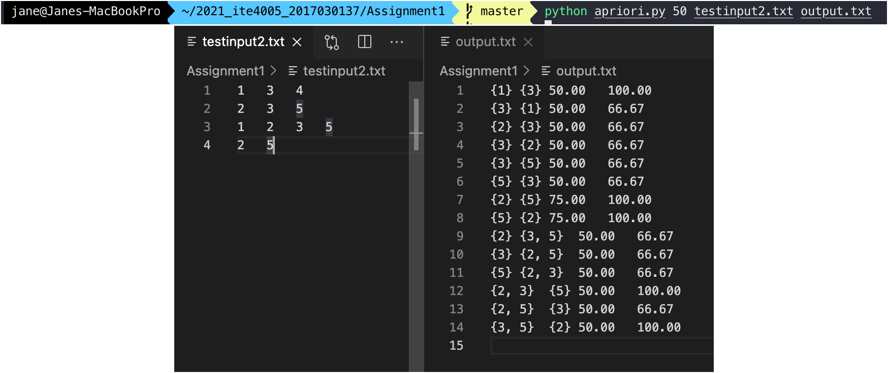

2017030137 이제인
# Programming Assignment #1 Report
## Find association rules using the Apriori algorithm

* transaction 별로 item id가 주어진다. 이들의 association rule을 찾고, 각 rule의 support와 confidence 값을 구한다.
* Apriori 알고리즘을 사용하여 frequent pattern을 찾는다.

---
### Apriori 알고리즘
* frequent 하지 않은 itemset이 있으면 이를 포함하는 superset은 generate하거나 test하지 않는다는 원칙을 이용한다.
1. 원소의 개수가 한 개인 itemset들부터 candidate으로 지정하여 시작한다. (이를 **C_1**이라 한다.) 이 중 frequent한 itemset들을 뽑는다. (이를 **L_1**이라 한다.)
2. 원소의 개수가 k인 frequent itemset들 (**L_k**) 을 조합하여 만들 수 있는 원소의 개수가 k+1인 itemset (**C_k+1**)이 다음 candidate가 된다.
3. candidate를 test한다.
4. frequent itemset이 더이상 존재하지 않거나 candidate를 더이상 못 만들 때까지 반복한다.
* 이 과정에서 만들어지는 모든 L들의 합집합이 전체 frequent set이다.

---
### 구현 방법
* `Apriori` class에서 frequent pattern을 찾고, 이를 통해 associaion rule을 만든다.

#### 1. frequent pattern (itemset) 구하기
* DB를 스캔하여 원소가 한 개인 1-itemset (**C_1**)을 구한다.
* frequent itemset이 없거나 다음 candidate itemset이 없을 때까지 loop를 돌린다.
    * `C`에 있는 itemset들 중 frequent한 것을 `L`에 추가한다. 이 때 itemset의 support값이 주어진 minimum support 값 이상이면 frequent한 것이다.
    * 만들어진 `L`을 `frequentSet`에 추가하고, 이를 통해 다음 `C`를 generate한다.
#### 1-1. C를 generate하기
* 길이가 k인 frequent set들을 join, prun하여 길이가 k+1인 다음 candidate set들을 만든다.
1. joining
    * `L`을 탐색하여 모든 set들 중 합쳤을 때 길이가 k+1이 되는 두 가지를 뽑아 합친다.
2. pruning
    * 합쳐진 set의 모든 원소들을에 대해 원소 한 개를 빼 길이가 k인 set을 만든다. 이 set이 `L`에 존재하지 않으면 다음 candidate가 될 수 없다.
* join, prun 과정을 거친 후 탈락하지 않은 candidate들이 다음 `C`가 된다.

#### 2. association rule 구하기
* frequent set들 중 1-itemset을 제외하고 각각을 조합하여 만들어지는 associative한 set 조합들을 구한다.
* 각 조합에 대해 support와 confidence 값을 구한다.

---
### 코드 설명
#### `__main__`
* `sys.argv`로 minimun support 값과 input/output 파일 이름을 입력받는다.
* input 텍스트파일을 읽어 `transactions` list에 한 줄씩 넣는다.
* `Apriori` class를 init 및 실행한다.
* 완성된 `associationRules` 내부의 rule tuple들을 output 형식에 맞추어 텍스트파일에 출력한다.

```python
if __name__ == '__main__':
    minSupport = float(sys.argv[1])
    inputFilename = sys.argv[2]
    outputFilename = sys.argv[3]

    transactions = list()

    # input
    inputFile = open(inputFilename, 'r')
    while True:
        line = inputFile.readline()
        if not line: break
        transactions.append(line.split('\t'))
        transactions[-1][-1].rstrip('\n')
        for i in range(0,len(transactions[-1])):
            transactions[-1][i] = int(transactions[-1][i])
    inputFile.close()

    # Apriori
    apriori = Apriori(minSupport, transactions)
    apriori.run()

    # output
    outputFile = open(outputFilename, 'w')
    for rule in apriori._associationRules:
        outstr = '%s\t%s\t%.2f\t%.2f\n' % (rule[0],rule[1],rule[2],rule[3])
        outputFile.write(outstr)
    outputFile.close()
```

#### `Apriori` class


* 입력 받은 mininum support값 `minSupport`과 transaction 별 item id 리스트 `transactions`를 저장한다.
* `frequentSet` list와 `associationRules` list을 만드는 과정을 `run`함수에서 진행한다.


#### `run` 함수
* `k`: 현재 `C`, `L`에 담긴 set들 내부 원소들의 개수
* `C`: candidate인 set들이 담긴 list
* `L`: frequent한 set들이 담긴 list

```python
def run(self):
    k = 1
    C = list()
    L = list()
```

1. 1-itemset구하기
    * transaction들을 탐색하며 모든 item들을 중복되지 않도록 candidate 리스트에 append한다.
    ```python
    for t in transactions:
        for i in t:
            if {i} not in C: C.append({i})
    ```

2. loop
    * 반복할 때마다 `L`을 빈 list로 초기화, `k`를 1씩 증가한다. 
    * `C`에 있는 itemset들을 탐색하여 `getSupport` 함수를 통해 support 값을 구한다. 이 값이 `minSupport` 이상인 itemset들을 중복되지 않도록 `L`에 추가한다.
    * 만들어진 `L`을 `frequentSet`에 추가하고, 이를 `generate` 함수를 통해 다음 `C`를 만든다.
    * 만들어진 `C`가 빌 때까지 loop를 돌린다.
    ```python
    while(True):
        L = list()
        for c in C:
            if round(self.getSupport(c),2)>= self._minSupport and c not in L:
                L.append(c)
        self._frequentSet.append(L)

        C = self.generate(L, k)
        
        if len(C)==0: break
        k+=1
    ```
3. association rule 만들기
    * `frequentSet`에 있는 각 itemSet에 대하여 `getAssociationRule` 함수를 통해 해당 set과 associative한 set들을 구한다.
    * 1-itemset은 제외한다.
    ```python
    for itemSets in self._frequentSet:
            for itemSet in itemSets:
                if len(itemSet)>1: self.getAssociationRule(itemSet)
    ```

#### `getSupport` 함수
* DB 내의 transaction들 중 주어진 `itemSet` 내부의 item들을 모두 포함할 확률을 구하는 함수
* `transactions`을 탐색하여 `itemSet`의 `item`이 하나라도 포함되지 않으면 `flag`를 바꾼다. 이를 통과할 경우 `supnum` 값을 1 증가한다.
* `supnum` 값을 `transactions`에 담긴 transaction 수로 나누고 100을 곱해 백분율 값을 리턴한다.
```python
def getSupport(self, itemSet):
    supnum=0
    for t in transactions:
        if len(t)<len(itemSet): pass
        flag=True
        for item in itemSet:
            if item not in t:
                flag=False
                break
        if flag: supnum += 1
    return supnum/len(transactions)*100
```

#### `generate` 함수
* 주어진 `L`에 대하여 다음 candidate `C`를 만드는 함수
* 주어지는 `L`에는 `k`개의 원소가 담긴 set들이 있고, 구하려는 `C`는 `k+1`개의 원소가 담긴 set들이 있어야 한다.
```python
def generate(self, L, k):
    C = list()
```
1. joining
* `L`을 탐색하여 `i1`번째 set, `i2`번째 set을 union연산하여 길이가 k+1이 되는 `unioned` set을 만든다.
```python
    for i1 in range(0,len(L)):
        for i2 in range(i1+1, len(L)):
            unioned = L[i1]|L[i2]
            if len(unioned)!=k+1: pass
```
2. pruning
* `unioned`를 탐색하여 원소를 하나씩 빼 만들어지는 길이가 k인 `tmp` 중 하나라도 `L`에 포함되어 있지 않으면 `flag`를 바꾼다.
* 이를 통과할 경우 `unioned`를 중복되지 않도록 `C`에 추가한다.
```python
            flag = True
            for i in unioned:
                tmp = unioned - {i}
                if tmp not in L:
                    flag=False
                    break
            if flag and unioned not in C: C.append(unioned)
    return C
```

#### `getAssociationRule` 함수
* 주어진 `itemSet`에 대한 association rule을 구해 (X, Y, support, confidence) 튜플을 `associationRules`에 추가하는 함수
* 가능한 모든 조합 집합을 `itertools` 모듈의 `combinations` 함수를 통해 구해 `combi`에 추가한다.
```python
def getAssociationRule(self, itemSet):
    combi=list()
    for l in range(1, len(itemSet)):
        combi = combi + list(combinations(itemSet,l))
```
* `combi`를 탐색하여 각 부분집합을 `X`로, 이를 제외한 부분을 `Y`로 놓고 '`X`->`Y`' rule을 구한다.
* rule의 support 값은 한 transaction이 X, Y를 모두 포함할 확률이므로 `itemSet`에 대하여 `getSupport` 함수를 통해 구한다.
* rule의 confidence값은 X를 포함하는 transaction이 Y도 포함할 조건부확률이므로 `itemSet`의 support 값을 `X`의 support값으로 나누어 구한다. 
```python
    for subset in combi:
        X = set(subset)
        Y = itemSet-set(subset)

        support = round(self.getSupport(itemSet),2)
        confidence = round(support/self.getSupport(X)*100,2)

        self._associationRules.append((X,Y,support,confidence))
```

---
### 컴파일 및 실행 결과


작은 데이터에 대하여 실행하면 다음과 같다.

