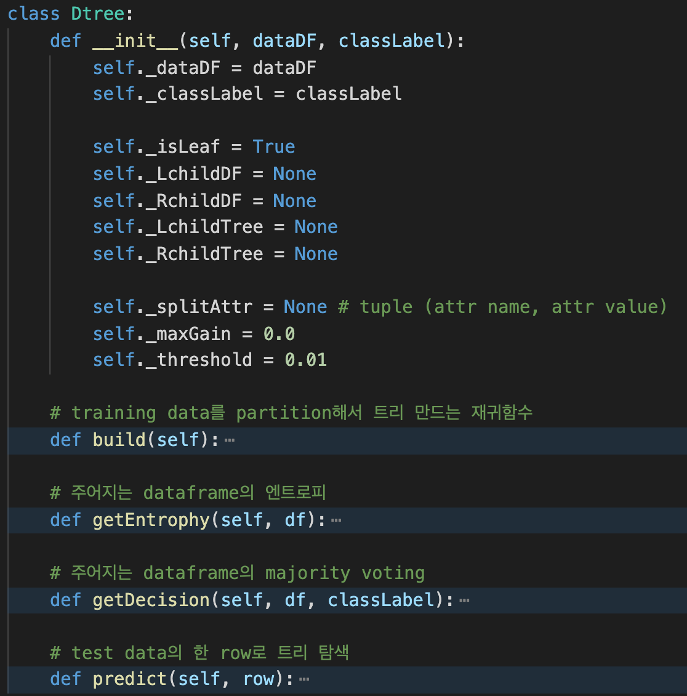
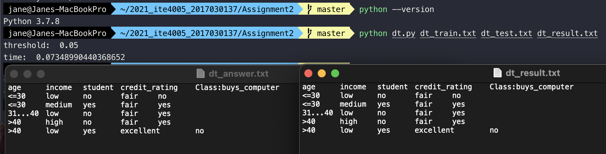
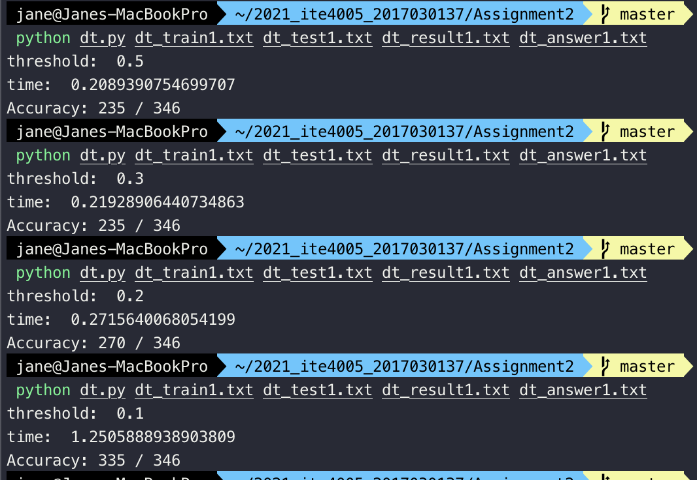
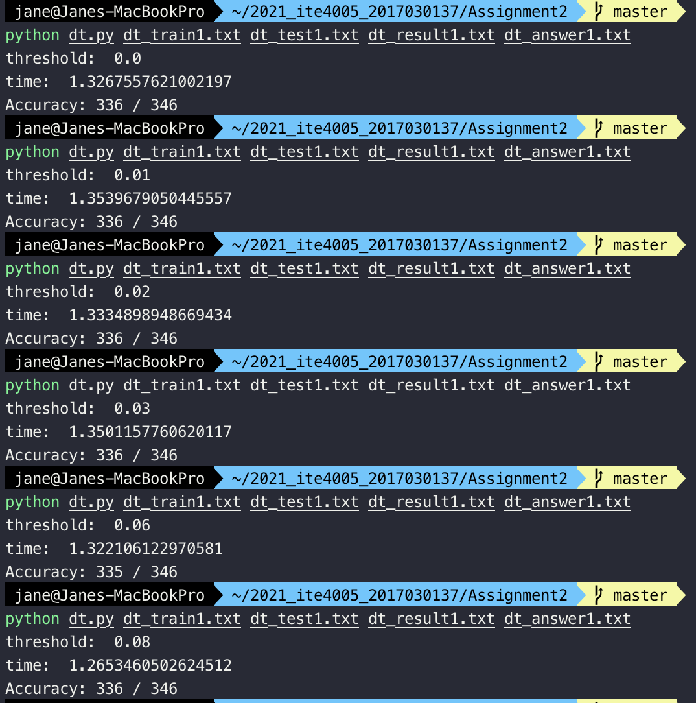
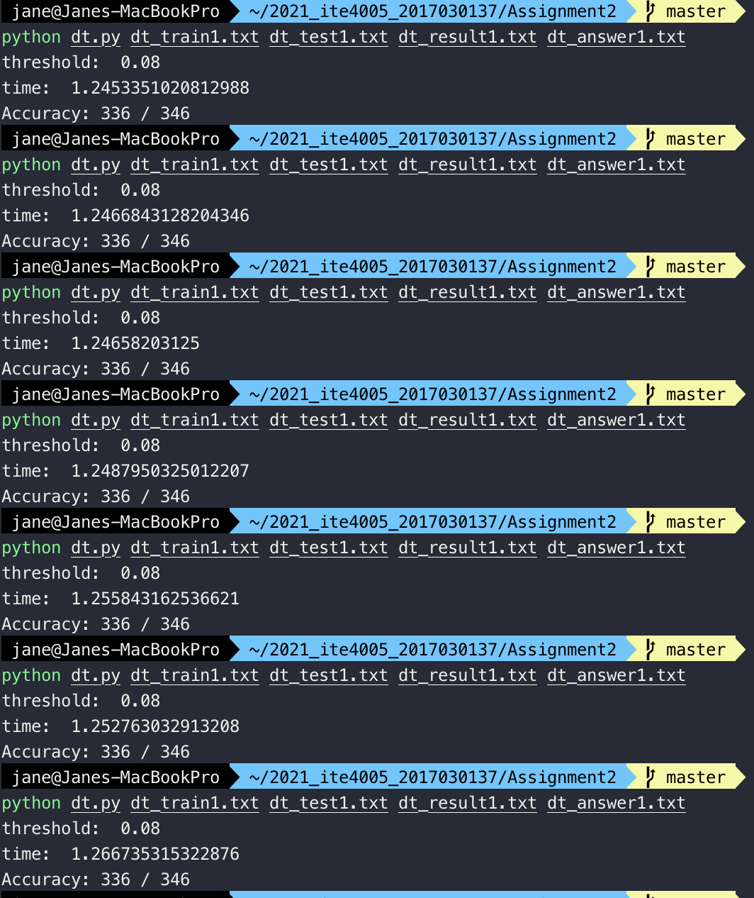

2017030137 이제인
# Programming Assignment #2 Report
## Build a decision tree, and then classify the test set using it

* 주어진 training dataset을 통해 Decision Tree를 만들고, 이를 이용해 test dataset의 class label을 예측한다.

---
### Decision Tree induction 알고리즘
* root에서 시작하여 내려가는 top-down 방식, 현 노드에서 greedy하게 attribute를 선택한다.
1. training data 내의 class label을 제외한 모든 attribute들을 탐색한다.
2. attribute의 값들을 binary partition한다. 한 종류의 값을 갖는 데이터들을 left, 다른 종류들의 값을 갖는 데이터들을 right으로 나눠 각각의 gain ratio를 구한다.
3. gain ratio가 최대가 되는 attribute와 이 때의 left, right 데이터들을 찾는다. 이들을 기준으로 split하여 child를 만든다.
4. 재귀 반복
5. gain 값이 더이상 갱신되지 않거나, threshold 값을 넘지 못하면 leaf 노드가 되어 더이상 split하지 않는다.

---
### 구현 방법
* `Dtree` class를 recursive하게 사용한다. (현재 다루는 트리 클래스가 현재 다루는 노드를 루트로 하는 서브트리라고 생각)

#### 1. decision tree 생성하기

#### 1-1. maximum gain ratio
* maximum **gain ratio**가 되는 attribute를 선택하여 이를 기준으로 **binary partition** 한다.
* training dataframe의 key 값들을 탐색한다. 마지막 key는 class label이므로 탐색에서 제외한다.
    * 탐색 중인 attribute `key`에 해당하는 값의 종류들 `values`을 뽑아 한 종류씩 탐색한다.
        * 탐색 중인 attribute의 값 `dataDF[key]`이 탐색 중인 종류 `value`와 같으면 left data로, 다르면 right data로 나눈다.
        * 나눠진 좌우 dataframe의 entrophy `leftE`, `rightE`와 차지하는 데이터 양의 비율 `leftP`, `rightP`을 각각 곱해 전체 dataframe의 enthrophy `parentE`에서 뺀다.
        * `gain` 값이 최대가 되도록 갱신한다.

#### 1-2. recursive

#### 2. 데이터 classify 하기
* 완성된 트리를 root부터 탐색하여 test dataframe 내의 데이터들의 class label을 predict한다.

---
### 코드 설명

#### library
* dataset을 dataframe으로 바꿔 다루기 위해 pandas 라이브러리 사용
```python
import sys
import pandas as pd
import math
import time
```

#### `__main__`
* `sys.argv`로 training, test dataset 파일 이름과 결과를 저장할 output 파일 이름을 입력받는다.
* input 텍스트 파일들을 pandas의 `read_csv` 함수로 읽어 두 데이터프레임을 생성하고, training dataset의 마지막 key 값을 `classLabel`로 지정한다.
* `Dtree` class를 init하고 `build` 함수를 통해 decision tree를 구성한다.
* 완성된 트리를 기반으로 `predict` 함수를 통해 각 test data들의 label을 예측하고, 그 값을 `decisions` 배열에 추가한다.
* `decisions` 배열을 test 데이터프레임에 추가한 후 pandas의 `to_csv` 함수를 통해 텍스트 파일로 저장한다.

```python
if __name__ == '__main__':
    trainingFilename = sys.argv[1]
    testFilename = sys.argv[2]
    outputFilename = sys.argv[3]

    # input
    trainingDF = pd.read_csv(trainingFilename, sep='\t')
    testDF = pd.read_csv(testFilename, sep='\t')    
    
    classLabel = trainingDF.keys()[-1]

    # build decision tree
    dt = Dtree(trainingDF, classLabel)
    dt.build()

    # classify
    decisions = list()
    for i in range(len(testDF)):
        decisions.append(dt.predict(testDF.iloc[i]))
    testDF[classLabel] = decisions

    # output
    testDF.to_csv(outputFilename, index=False, sep='\t')
```

#### `Dtree` class


* `Dtree` 클래스는 `dataDF` 데이터를 가진 노드를 루트로 하는 서브트리를 의미한다.
    * `main`에서 처음으로 만들어지는 클래스가 전체의 루트를 의미한다.
* 트리가 처음 생성될 때 `isLeaf` 값을 `True`로 주고, 자식 서브트리가 생길 때 (partition이 일어날 때) 이 값이 바뀐다.
* `threshold` 값에 따라 성능의 차이가 생긴다.
* `build` 함수를 통해 decision tree를 생성하고, `predict` 함수를 통해 이 트리에 따라 데이터를 classify해 class label을 예측한다.


#### `build` 함수
* `self._dataDF`를 기준으로 진행
* `key`: 탐색 중인 attribute
* `nowAttrCol`: 탐색 중인 column
* `values`: 탐색 중인 attribute에 해당하는 값의 종류 list
```python
def build(self):
    for key in self._dataDF.keys()[:-1]:
        nowAttrCol = self._dataDF[key]
        values = nowAttrCol.unique()
```

* `value`: 탐색 중인 값의 종류
* `parentE`: partition 전 dataframe의 enthrophy\
* 탐색 중인 attribute의 값 `dataDF[key]`이 탐색 중인 종류 `value`와 같으면 left data로, 다르면 right data로 binary parition
* `gain`: 나눠진 좌우 dataframe의 entrophy `leftE`, `rightE`와 차지하는 데이터 양의 비율 `leftP`, `rightP`을 각각 곱해 `parentE`에서 뺀 값
```python
        parentE = self.getEntrophy(self._dataDF)
        for value in values:
            leftDF = self._dataDF.loc[self._dataDF[key]==value]
            rightDF = self._dataDF.loc[self._dataDF[key]!=value]

            leftE = self.getEntrophy(leftDF)
            leftP = len(leftDF)/len(self._dataDF)
            rightE = self.getEntrophy(rightDF)
            rightP = len(rightDF)/len(self._dataDF)
            
            gain = parentE - (leftE*leftP + rightE*rightP)
```

* `gain` 값이 최대가 되도록 갱신한다.
* 갱신이 일어나면 현재 탐색 중인 attribute을 기준으로 left data와 right data가 두 개의 자식 서브트리를 만든다.
* 갱신이 일어난 attribute의 key, value 값을 `splitAttr`에 저장한다.
```python
            if gain > self._maxGain:
                self._isLeaf = False
                self._splitAttr = (key, value)
                self._maxGain = gain
                self._LchildDF = leftDF
                self._RchildDF = rightDF
                self._LchildTree = Dtree(leftDF, self._classLabel)
                self._RchildTree = Dtree(rightDF, self._classLabel)
```

* 모든 탐색을 마치면 maximum gain ratio를 기준으로 서브트리를 생성하기 위해 두 자식에서 `build` 함수를 재귀 호출한다.
* 갱신이 일어나지 않거나 threshold를 넘지못할 경우 이를 leaf로 판단, 재귀를 멈춘다.

```python
    if self._isLeaf or self._maxGain<self._threshold: 
        pass
    else:            
        self._LchildTree.build()
        self._RchildTree.build()
```

#### `getEntrophy` 함수
* 주어지는 dataframe의 entrophy를 계산하는 함수
* class label에 해당하는 값의 종류 별 개수를 담는 {라벨:개수} dictionary `labelNum`을 만든다.
```python
def getEntrophy(self, df):
    labelNum = dict()
    for row in df[self._classLabel]:
        if row not in labelNum: labelNum[row] = 1
        else: labelNum[row] += 1
```
* 라벨 종류 별 차지하는 비율 `p`와 이에 log를 취한 값을 곱해 구한 entrophy 값을 return한다.
```python    
    e = 0.0
    for key in labelNum:
        p = float(labelNum[key]) / len(df)
        e -= p * math.log(p, 2)
    return e
```

#### `predict` 함수
* 주어지는 한 줄의 데이터 `row`로 트리를 탐색해 데이터 label을 구하는 함수
* leaf까지 내려가면 `getDecision` 함수를 통해 얻은 label 값을 return 한다.
```python
def predict(self, row):
    if self._isLeaf:
        return self.getDecision(self._dataDF, self._classLabel)
```
* 자식 서브트리가 남아있으면 `splitAttr`에 따라 left data를 따라갈지, right data를 따라갈지 정하여 그 서브트리에서 `predict` 함수를 재귀호출한다.
```python    
    else:
        key = self._splitAttr[0]
        value = self._splitAttr[1]
        
        if row[key]==value: return self._LchildTree.predict(row)
        else: return self._RchildTree.predict(row)
```


#### `getDecision` 함수
* **majority voting**: 주어지는 dataframe `df`의 `classLabel` attribute 값들 중 가장 개수가 많은 것을 return 한다.

```python
def getDecision(self, df, classLabel):
    return df[classLabel].value_counts().idxmax()
```
---
### 컴파일 및 실행 결과


```shell
python dt.py dt_train.txt dt_test.txt dt_result.txt
```

작은 데이터에 대해 실행한 결과 result 파일과 answer 파일이 같음을 알 수 있다.

---
### 테스트

* answer 파일 경로를 `sys.argv` 4번째 인자로 입력했을 때 다음과 같이 accuracy를 출력하게 했다.

`Dtree` class를 init할 때 지정해주는 threshold 값의 변화에 따른 성능 차이는 다음과 같다.




값이 0.1 보다 크면 accuracy가 많이 떨어지고, 이하일 경우 어느 정도 비슷하다.



값이 같아도 약간의 시간 차이가 존재한다.

여러 번의 테스트를 거쳐 0.08로 threshold를 결정했다.